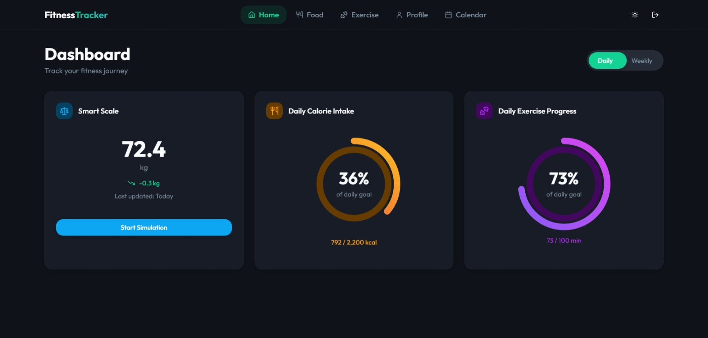
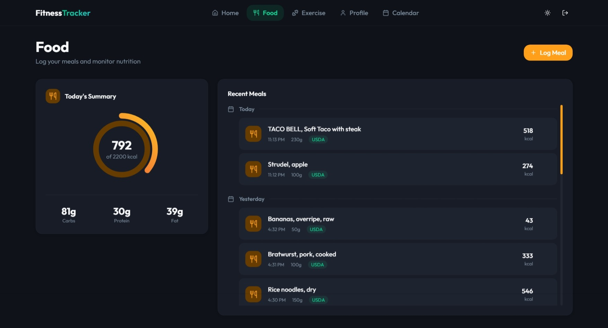
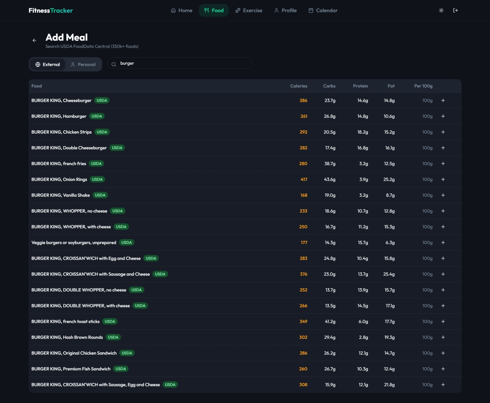
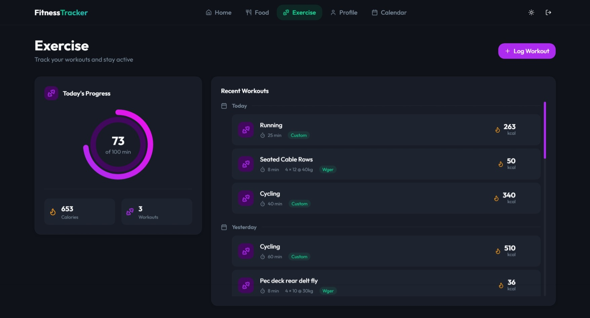
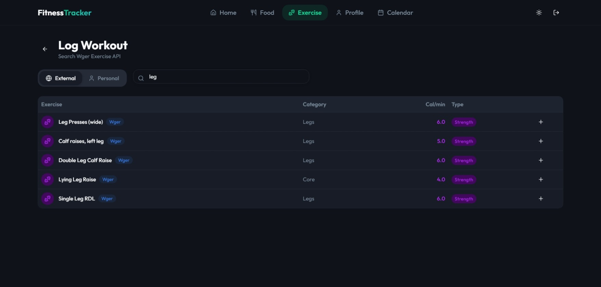
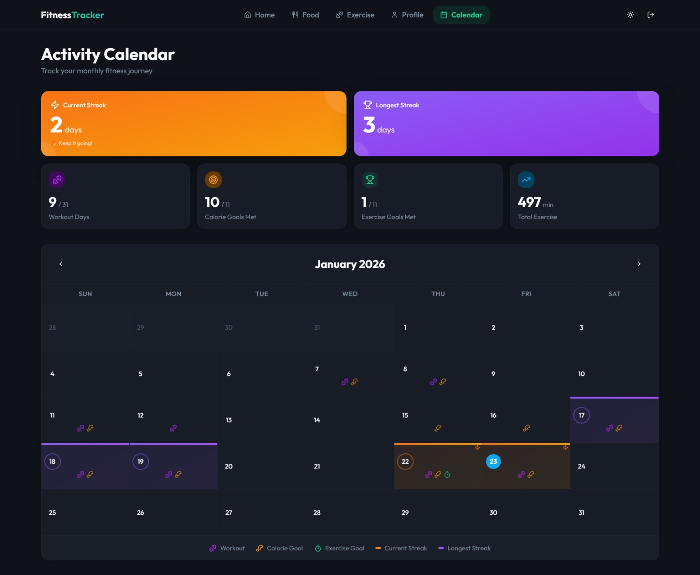
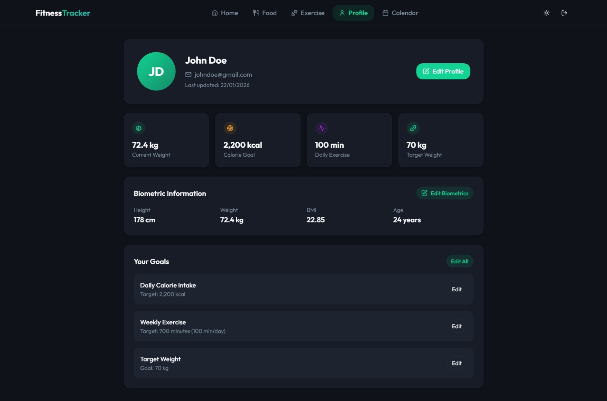

<div align="center">

# Fitness Tracker App

### A full-stack fitness tracking application built with **Spring Boot** and **React/TypeScript**.

[](https://adoptium.net/)
[](https://spring.io/projects/spring-boot)
[](https://www.postgresql.org/)
[](https://www.typescriptlang.org/)
[](https://react.dev/)

*Track your nutrition, workouts, weight, and fitness goals with real-time data from USDA FoodData Central and WGER Exercise databases*

[Features](#features) •
[Tech Stack](#tech-stack) •
[Getting Started](#getting-started) •
[API Docs](#api-documentation)

</div>

---

## Table of Contents

- [Features](#features)
- [Screenshots](#screenshots)
- [Tech Stack](#tech-stack)
- [Getting Started](#getting-started)
- [API Documentation](#api-documentation)
- [Database Schema](#database-schema)
- [Project Structure](#project-structure)
- [License](#license)
- [Acknowledgments](#acknowledgments)

---

## Features

<table>
<tr>
<td width="50%">

### Nutrition Tracking
- Search **300,000+ foods** from USDA FoodData Central
- Log meals with precise gram measurements
- Track daily calorie intake vs goals
- View macro breakdown (protein, carbs, fats)
- Create custom personal foods

</td>
<td width="50%">

### Exercise Management
- Access **800+ exercises** from WGER database
- Create custom personal exercises
- Log workouts with sets, reps, weight, duration
- Support for cardio & strength training
- Track calories burned per exercise

</td>
</tr>
<tr>
<td width="50%">

### Smart Scale Integration
- Simulated smart scale for weight tracking
- Automatic BMI calculation
- Weight trend analysis (up/down/stable)
- Historical weight data visualization

</td>
<td width="50%">

### Activity Calendar
- Monthly calendar view of all activities
- Current streak & longest streak tracking
- Visual indicators for goals
- Day-by-day breakdown of meals & exercises

</td>
</tr>
<tr>
<td width="50%">

### Dashboard & Analytics
- Real-time daily overview
- Weekly statistics with charts
- Progress tracking towards goals
- Summary statistics

</td>
<td width="50%">

### User Management
- JWT-based authentication
- User profile management
- Biometrics tracking
- Customizable fitness goals

</td>
</tr>
</table>

---

## Screenshots

### Dashboard


### Nutrition Page


### Log Food


### Exercise Page


### Log Exercise


### Activity Calendar


### Profile


---

## Tech Stack

<table>
<tr>
<td width="50%" valign="top">

### Backend
- **Java 17** - Programming language
- **Spring Boot 3.2** - Application framework
- **Spring Security** - JWT authentication
- **Spring Data JPA** - Database access
- **Spring WebFlux** - Reactive HTTP client
- **PostgreSQL** - Relational database
- **Lombok** - Reduce boilerplate
- **Maven** - Build & dependency management

</td>
<td width="50%" valign="top">

### Frontend
- **React 19** - UI library
- **TypeScript 5.9** - Type-safe JavaScript
- **React Router 7** - Client-side routing
- **Axios** - HTTP client
- **Tailwind CSS 3** - Utility-first styling
- **Radix UI** - Accessible components
- **Recharts** - Data visualization
- **Framer Motion** - Animations
- **date-fns** - Date utilities

</td>
</tr>
</table>

### External APIs
- **USDA FoodData Central** - Nutrition data for 300,000+ foods
- **WGER Workout Manager** - Exercise database

---

## Getting Started

### Prerequisites

Before you begin, ensure you have the following installed:

| Tool | Version | Download |
|------|---------|----------|
| **Java** | 17+ | [Download](https://adoptium.net/) |
| **Maven** | 3.8+ | [Download](https://maven.apache.org/download.cgi) |
| **PostgreSQL** | 14+ | [Download](https://www.postgresql.org/download/) |
| **Node.js** | 18+ | [Download](https://nodejs.org/) |

---

### Installation

#### 1. Clone the Repository

```bash
git clone https://github.com/yourusername/fitness-tracker-app.git
cd fitness-tracker-app
```

#### 2. Set Up the Database

```sql
CREATE DATABASE fitness_tracker;
```

> **Note:** Tables are automatically created on first run via Spring Boot's auto-DDL feature.

---

#### 3. Configure Environment Variables

<details>
<summary><b>Windows (PowerShell)</b></summary>

```powershell
$env:DB_NAME="fitness_tracker"
$env:DB_USER="postgres"
$env:DB_PASS="your_password"
$env:JWT_SECRET="your_64_character_secret_key"
$env:USDA_API_KEY="your_usda_api_key"
$env:WGER_API_KEY="your_wger_api_key"
```

</details>

<details>
<summary><b>Linux/Mac</b></summary>

```bash
export DB_NAME=fitness_tracker
export DB_USER=postgres
export DB_PASS=your_password
export JWT_SECRET=your_64_character_secret_key
export USDA_API_KEY=your_usda_api_key
export WGER_API_KEY=your_wger_api_key
```

</details>

---

#### 4. Run the Backend

```bash
mvn spring-boot:run
```

Backend starts on **`http://localhost:8080`**

---

#### 5. Run the Frontend

```bash
cd frontend
npm install
npm run dev
```

Frontend starts on **`http://localhost:5173`**

---

## Environment Variables

| Variable | Description | How to Obtain |
|----------|-------------|---------------|
| `DB_NAME` | PostgreSQL database name | Your PostgreSQL setup |
| `DB_USER` | PostgreSQL username | Your PostgreSQL setup |
| `DB_PASS` | PostgreSQL password | Your PostgreSQL setup |
| `JWT_SECRET` | JWT signing key (64+ chars) | Generate: `-join ((65..90) + (97..122) + (48..57) \| Get-Random -Count 64 \| % {[char]$_})` |
| `USDA_API_KEY` | USDA FoodData Central API key | [Sign up here](https://fdc.nal.usda.gov/api-key-signup.html) |
| `WGER_API_KEY` | WGER API key | [Get key here](https://wger.de/en/software/api) |

---

## API Documentation

> **Authentication Required:** All endpoints require JWT authentication (except register/login).
> Include token in header: `Authorization: Bearer <token>`

---

### Authentication

<details>
<summary><b>POST</b> <code>/api/users/register</code> - Register new user</summary>

**Request:**
```json
{
  "username": "john_doe",
  "email": "john@example.com",
  "password": "SecurePass123!",
  "firstname": "John",
  "lastname": "Doe"
}
```

**Response:**
```json
{
  "token": "eyJhbGciOiJIUzI1NiIs...",
  "user": {
    "id": 1,
    "username": "john_doe",
    "email": "john@example.com",
    "firstName": "John",
    "lastName": "Doe"
  }
}
```

</details>

<details>
<summary><b>POST</b> <code>/api/users/login</code> - Authenticate user</summary>

**Request:**
```json
{
  "usernameOrEmail": "john_doe",
  "password": "SecurePass123!"
}
```

**Response:**
```json
{
  "token": "eyJhbGciOiJIUzI1NiIs...",
  "user": {
    "id": 1,
    "username": "john_doe",
    "email": "john@example.com",
    "firstName": "John",
    "lastName": "Doe"
  }
}
```

</details>

---

### Dashboard

| Method | Endpoint | Description |
|--------|----------|-------------|
| `GET` | `/api/dashboard` | Today's dashboard (calories, exercise, weight) |
| `GET` | `/api/dashboard/daily` | Alias for above |
| `GET` | `/api/dashboard/date?date=2024-01-15` | Dashboard for specific date |
| `GET` | `/api/dashboard/weekly` | Weekly calories and exercise data |
| `GET` | `/api/dashboard/summary` | Overall statistics |

---

### Food

| Method | Endpoint | Description |
|--------|----------|-------------|
| `GET` | `/api/foods` | All accessible foods |
| `GET` | `/api/foods/personal` | User's custom foods |
| `GET` | `/api/foods/external` | External/seeded foods |
| `GET` | `/api/foods/search/usda?q=chicken&limit=20` | Search USDA database |
| `POST` | `/api/foods` | Create custom food |
| `DELETE` | `/api/foods/{id}` | Delete custom food |

---

### Food Logs

| Method | Endpoint | Description |
|--------|----------|-------------|
| `GET` | `/api/food-logs` | All user's food logs |
| `GET` | `/api/food-logs/today` | Today's food logs |
| `GET` | `/api/food-logs/date/{date}` | Logs for specific date |
| `POST` | `/api/food-logs` | Log a personal food |
| `POST` | `/api/food-logs/external` | Log an external (USDA) food |
| `DELETE` | `/api/food-logs/{id}` | Delete a food log |

<details>
<summary><b>Example:</b> Log Personal Food</summary>

```json
{
  "foodId": 123,
  "quantityGrams": 150
}
```

</details>

<details>
<summary><b>Example:</b> Log External Food</summary>

```json
{
  "foodName": "Chicken Breast",
  "calories": 165,
  "protein": 31,
  "fats": 3.6,
  "carbs": 0,
  "quantityGrams": 200
}
```

</details>

---

### Exercise

| Method | Endpoint | Description |
|--------|----------|-------------|
| `GET` | `/api/exercises` | All accessible exercises |
| `GET` | `/api/exercises/personal` | User's custom exercises |
| `GET` | `/api/exercises/external` | External/seeded exercises |
| `GET` | `/api/exercises/search/wger?q=bench&limit=20` | Search WGER database |
| `POST` | `/api/exercises` | Create custom exercise |
| `DELETE` | `/api/exercises/{id}` | Delete custom exercise |

---

### Exercise Logs

| Method | Endpoint | Description |
|--------|----------|-------------|
| `GET` | `/api/exercise-logs` | All user's exercise logs |
| `GET` | `/api/exercise-logs/today` | Today's exercise logs |
| `GET` | `/api/exercise-logs/week` | This week's exercise logs |
| `GET` | `/api/exercise-logs/date/{date}` | Logs for specific date |
| `POST` | `/api/exercise-logs` | Log a personal exercise |
| `POST` | `/api/exercise-logs/external` | Log an external (WGER) exercise |
| `DELETE` | `/api/exercise-logs/{id}` | Delete an exercise log |

<details>
<summary><b>Example:</b> Log Personal Exercise</summary>

```json
{
  "exerciseId": 45,
  "durationMinutes": 30,
  "sets": 3,
  "reps": 10,
  "weightUsed": 50
}
```

</details>

<details>
<summary><b>Example:</b> Log External Exercise</summary>

```json
{
  "exerciseName": "Bench Press",
  "category": "Chest",
  "exerciseType": "STRENGTH",
  "caloriesBurntPerMinute": 8.0,
  "durationMinutes": 20,
  "sets": 4,
  "reps": 8,
  "weightUsed": 60
}
```

</details>

---

### Smart Scale

| Method | Endpoint | Description |
|--------|----------|-------------|
| `POST` | `/api/smart-scale/simulate` | Simulate weighing (generates reading) |
| `GET` | `/api/smart-scale/readings` | All weight readings |
| `GET` | `/api/smart-scale/readings/latest` | Latest weight reading |
| `GET` | `/api/smart-scale/readings/weekly-trend` | Last 7 days of readings |
| `GET` | `/api/smart-scale/readings/recent?limit=10` | Recent readings |

---

### Calendar

| Method | Endpoint | Description |
|--------|----------|-------------|
| `GET` | `/api/calendar/month/{year}/{month}` | Monthly activity data |
| `GET` | `/api/calendar/day/{date}` | Single day details |
| `GET` | `/api/calendar/streaks` | Current and longest streaks |

---

### Goals

| Method | Endpoint | Description |
|--------|----------|-------------|
| `GET` | `/api/goals` | Get user's goals |
| `POST` | `/api/goals` | Create or update goals |

<details>
<summary><b>Example:</b> Set Goals</summary>

```json
{
  "targetWeightKg": 75.0,
  "dailyCalorieGoal": 2000,
  "weeklyExerciseGoalMinutes": 150
}
```

</details>

---

### Biometrics

| Method | Endpoint | Description |
|--------|----------|-------------|
| `GET` | `/api/biometrics/latest` | Latest biometrics |
| `GET` | `/api/biometrics/history` | Biometrics history |
| `POST` | `/api/biometrics` | Create or update biometrics |

<details>
<summary><b>Example:</b> Update Biometrics</summary>

```json
{
  "heightCm": 175,
  "weightKg": 80,
  "gender": "MALE",
  "age": 28
}
```

</details>

---

### User Profile

| Method | Endpoint | Description |
|--------|----------|-------------|
| `GET` | `/api/users/me` | Get current user |
| `PUT` | `/api/users/me` | Update profile |

---

## Database Schema

### Key Entities

| Entity | Description |
|--------|-------------|
| `users` | User accounts and credentials |
| `user_biometrics` | Height, weight, age, gender |
| `user_goals` | Calorie and exercise goals |
| `food` | Food items (personal and external) |
| `food_logs` | Daily food intake records |
| `exercise` | Exercises (personal and external) |
| `exercise_logs` | Workout session records |
| `smart_scale_readings` | Weight measurements |
| `daily_summaries` | Aggregated daily statistics |

### Auto-Generation

Tables are automatically created using:
```properties
spring.jpa.hibernate.ddl-auto=update
```

> **Production Note:** For production deployments, consider switching to database migration tools like Flyway or Liquibase and setting `spring.jpa.hibernate.ddl-auto=validate`.

---

## Project Structure

```
fitness-tracker-app/
├── backend/
│   └── src/main/java/com/davidgeamanu/fitnesstrackerapp/
│       ├── controller/        # REST API endpoints
│       ├── service/           # Business logic
│       │   └── impl/          # Service implementations
│       ├── model/             # JPA entities
│       ├── repository/        # Data access layer
│       ├── dto/               # Request/response objects
│       ├── mapper/            # Entity-DTO mappers
│       ├── security/          # JWT authentication
│       └── config/            # App configuration
├── frontend/
│   └── src/
│       ├── components/        # React components
│       │   ├── layout/        # Navbar, PageTransition
│       │   ├── ui/            # Reusable UI components
│       │   └── profile/       # Profile components
│       ├── pages/             # Page components
│       ├── services/          # API service layer
│       ├── hooks/             # Custom React hooks
│       ├── types/             # TypeScript types
│       └── lib/               # Utilities
├── pom.xml                    # Maven configuration
├── LICENSE                    # MIT License
└── README.md
```

---

## License

This project is licensed under the **MIT License** - see the [LICENSE](LICENSE) file for details.

---

## Author

**David Geamanu**

---

## Acknowledgments

Special thanks to:

- [USDA FoodData Central](https://fdc.nal.usda.gov/) - Comprehensive nutrition database
- [WGER Workout Manager](https://wger.de/) - Open-source exercise database
- [Spring Boot](https://spring.io/projects/spring-boot) - Java framework
- [React](https://react.dev/) - Powerful UI library
- [Tailwind CSS](https://tailwindcss.com/) - Utility-first CSS framework
- [Radix UI](https://www.radix-ui.com/) - Accessible component primitives

---

